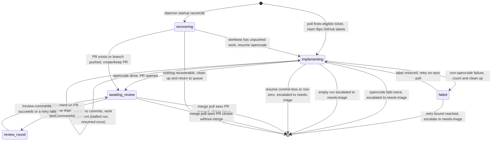

# Carbotracker orchestrator

`ct-orchestrator.sh` is the ticket-to-PR pipeline: it polls GitHub for
`ready-for-agent` tickets, claims them up to a concurrency cap, and runs each
one through a full implementation cycle — worktree, dependency install,
headless `opencode`, and finally a pushed branch with a pull request. Once a
PR is up it runs the **merge poll** (detecting merged or closed PRs and
cleaning up) and the **review loop**: every poll it checks awaiting-review PRs
for new comments and, when it finds one, runs an **analyze** step — resuming
the original opencode session with the headless `/review-comments` skill, which
writes a structured plan — and an **act** step that applies the plan (posting
replies and pausing for human decisions). It runs as a systemd user service
(see `carbotracker-orchestrator.service`).

On startup the daemon first **reconciles** the state file against observable
git facts (see [Crash recovery](#crash-recovery)), so a VPS restart or crashed
run resumes from what actually exists on disk rather than from stale in-memory
state. A failing `opencode run` is retried once with `--continue` before the
ticket is escalated to a human (see [opencode failures](#opencode-failures)).
An `opencode run` that exits 0 without committing is classified as a **stalled
run** (uncommitted work left behind; its session is resumed exactly once) or an
**empty run** (clean tree; escalated immediately with no resume) — see
[No-commit runs: stalled vs empty](#no-commit-runs-stalled-vs-empty).

Between polls the daemon also **self-refreshes**: it hashes its own script at
load time and, when the on-disk hash differs at the top of a poll cycle, it
re-execs itself to load the new code — including `ct-lib.sh`. This keeps a
long-running daemon in sync with the repo it lives in (a main update once
renamed a helper script out from under a running daemon and broke every review
round); it never happens mid-poll, so an in-flight implement run is never
orphaned.

## Lifecycle

A ticket moves through phases as the orchestrator works it:



`implementing` means the orchestrator is actively running a session for the
ticket; `failed` means a non-opencode failure is waiting for a bounded retry;
`awaiting review` means the PR exists and a human should look at it. Only
`implementing` entries count against the concurrency cap.

A claim is recorded **twice**: on the GitHub issue (remove `ready-for-agent`,
add `in-progress`) and in the local state file. The label flip is what makes
the claim visible to humans and atomic against parallel orchestrators — once
an issue drops `ready-for-agent` it stops matching the candidate query, so a
second daemon cannot claim it.

## Merge detection and cleanup

Each poll, before the review loop, the orchestrator walks every state entry in
`awaiting review` that has a PR number and checks the PR's state via
`gh pr view <n> --json state`:

- **`MERGED`** — the human merged the PR. The orchestrator drops the
  `in-progress` label, closes the issue with the comment
  "PR #&lt;n&gt; merged. Issue closed.", prunes the worktree and branch, and
  removes the entry from the state file. The lifecycle (issue → PR → merged →
  closed) is complete and the ticket no longer occupies a concurrency slot. If
  the close fails, the entry is **kept** so the merge is re-detected and the
  close retried on the next poll — the closure is never silently dropped.
- **`CLOSED`** — the PR was closed without merging: the work is rejected. The
  orchestrator escalates the issue to a human — drops `in-progress`, adds
  `needs-triage`, and leaves a comment naming the closed PR — then prunes the
  worktree and branch. Uncommitted work is stashed before the prune and named
  in the comment (see [Escalation stashing](#escalation-stashing)). The entry
  is removed only once the escalation lands, so a transient `gh` failure
  retries next poll instead of stranding an un-labelled issue.
- **`OPEN`** — the merge status is checked. Both auto-merge actions share the
  merge-gate skip: a PR carrying `suspect-diff` without `human-approved` is
  skipped entirely — the labels are read fresh from GitHub each poll, so a
  maintainer adding `human-approved` unblocks the PR automatically on the next
  poll. A PR with status **`BEHIND`** is updated by fetching `origin/main`,
  merging it with `--no-ff`, and pushing the branch normally (never a rebase or
  force-push). The daemon verifies that `origin/main` is an ancestor of the
  branch tip before the push, then re-fetches and verifies again after the
  push, so the remote is confirmed to contain the merged branch — an unverified
  push is never trusted. A conflicting merge is aborted (`git merge --abort`)
  so the worktree is left clean for a retry; push failures and failed
  verification keep the entry for the next poll.
  A PR with status **`DIRTY`** — GitHub's signal that its merge into `main`
  conflicts — is delegated to the agent: the ticket's opencode session is
  resumed with a merge prompt, the agent merges `origin/main` and commits
  (never pushing), and the daemon then verifies `origin/main` became an
  ancestor of the branch tip, pushes, and re-verifies against the re-fetched
  remote — never trusting the agent's exit code. Auto-merge attempts are
  bounded by `ORCHESTRATOR_MERGE_RETRIES` (default 3): a failing attempt is
  counted in the entry's `mergeFailures`, and at the cap the daemon posts a
  "needs a human" comment on the PR (retried on later polls until it lands) and
  stops auto-merging it.
- **anything else / gh failure** — the state query failed; the entry is kept
  so the merge is retried on the next poll.

## Overlap warning

When a PR is opened (the normal push-and-open path and the crash-recovery
path alike), the orchestrator compares the branch's changed files (read from
the worktree with `git diff --name-only origin/main...HEAD`, so the check does
not depend on the freshly created PR's file list having propagated to the API)
against every open PR's changed files (`gh pr view <n> --json files`). On
overlap it posts a warning comment on the new PR naming each overlapping PR and
the shared files. Overlap is expected during migrations, so it only warns — it
never blocks or queues, and a PR that shares no files gets no comment. Any
`gh`/`git` failure skips the check (non-fatal), and the new PR itself is never
compared against itself.

## Merge gate

The merge gate is a pair of required status checks — the `merge-gate` and
`rules-gate` jobs in `.github/workflows/merge-gate.yml` — that run on every PR
open/sync/re-label event; branch protection on `main` requires them.

- `merge-gate` fails iff the PR carries `suspect-diff` without `human-approved`,
  so a flagged (off-task) PR cannot be merged by accident. A maintainer who has
  eyeballed a suspect PR adds `human-approved` to unblock it (the `suspect-diff`
  label may remain as an audit trail); removing `suspect-diff` also flips the
  gate green.
- `rules-gate` fails iff the PR modifies `apps/carbotracker/firestore.rules`
  without `security-rule-approved`, so a rules diff needs a human's sign-off
  before it merges (rules deploy on merge and are project-global — see
  ADR-0006).

`merge-gate` reads only the PR's labels from the event payload, so it needs no
permissions and no checkout; `rules-gate` additionally checks out the branch to
diff the rules file against its base. Both labels are bootstrapped by
`orchestrator_ensure_labels`.

## Crash recovery

The state file is the orchestrator's memory, never the source of truth. On
daemon startup (`once` mode too) the orchestrator runs `orchestrator_reconcile`,
which walks every entry in the state file and inspects the observable facts —
does the worktree directory exist, what does `git status`/`git log` say, is the
branch pushed (`git ls-remote`), and is there a PR for the branch (`gh pr list
--head <branch> --state all`). It then transitions each ticket to the phase
that matches reality:

- **PR exists** — the implementation finished; set phase `awaiting review`,
  record the PR number, and let the merge/review polls pick the entry up from
  the next poll.
- **Branch pushed, no PR** — the crash happened between push and PR creation.
  The orchestrator creates the PR (`gh pr create`), transitions to
  `awaiting review`, and comments "Started implementation. PR #&lt;n&gt;
  created." Duplicate PRs are impossible: `pr list --state all` also matches a
  merged or closed PR, so a branch that already has one is never re-created.
- **Worktree has unpushed work** (local changes or commits not on the remote
  branch) — the crash interrupted an implementation. Dependencies were already
  installed before the agent started, so the orchestrator resumes the run
  directly: `opencode run --auto --continue` (or `--session <id>` when the
  state file already records one) with `/implement`, then push, PR, and
  `awaiting review`. The same opencode retry/escalation rules apply as for a
  fresh run.
- **Nothing recoverable** (clean worktree, branch never pushed, no PR, or the
  worktree is gone) — the crash happened before any work landed. The
  orchestrator prunes the worktree and branch, comments on the issue that no
  recoverable work was found, drops `in-progress`, and removes the entry from
  state. The comment is the handoff to a human: `ready-for-agent` is **not**
  re-added automatically, so a broken ticket does not loop through the
  pipeline — re-tag it to retry.

Each entry is handled independently; a failure on one (e.g. `gh` transiently
down) logs a warning and leaves the entry for the next restart rather than
blocking the rest.

## opencode failures

A fresh or resumed implementation runs `opencode run --auto` (with `--title`,
`--session`, or `--continue` depending on the situation). On a non-zero exit it
is **retried once** with `opencode run --auto --continue` against the same
session. If the retry also fails, the orchestrator **escalates**: it removes
`in-progress` and `ticket` (the `ready-for-agent` label was already removed at
claim time), adds `needs-triage`, comments on the issue with the failure reason
and the tail of the run's output, prunes the worktree and branch, and removes
the entry from state. Uncommitted work is stashed before the prune (see
[Escalation stashing](#escalation-stashing)). The ticket is now a human
problem, not a pipeline retry-loop. If the escalation itself fails, the entry
stays in state and the poll loop's normal un-claim/cleanup path removes it.

## Escalation stashing

Every escalation that prunes a worktree first stashes any uncommitted work —
tracked changes and untracked files alike (`git stash push --include-untracked`)
— so a failed run's half-written work survives for a maintainer to recover from
`git stash list`. The stash message follows the contract
`carbotracker: ticket <number> uncommitted work at escalation (<ISO-8601 UTC
timestamp>, session <id>)`; the escalation comment and the prune log line both
name the entry. A clean or missing worktree creates no stash.

The stash protects the work, so the escalation is **fail-closed**: when a dirty
worktree's stash fails, the prune is deferred — the entry and worktree stay put
and the escalation is retried (the merge-poll path retries next poll; the
implement path retries when the daemon re-visits the entry on a restart), rather
than destroying the very work the stash exists to protect.

The stash is created before the escalation comment is posted, so the comment
names the actual entry. If the escalation fails to land (`gh` down) after the
stash succeeded, the stash is popped again to restore the dirty worktree: on the
merge-poll path the next poll re-stashes with a fresh timestamp and names its
own entry, and on the implement path the restored work is picked up by a later
resume — never pruned.

## No-commit runs: stalled vs empty

When `opencode run` exits 0 but the branch tip still sits at `origin/main`
(the branch has no commits), a PR cannot be opened. The orchestrator splits
that zero-commit exit by the worktree before escalating:

- **Stalled run** — the worktree holds uncommitted work (any change that shows
  in `git status --porcelain`; ignored files like `dist` don't count). The
  agent stopped mid-thought, so its session is **resumed exactly once**: a
  single `opencode run --auto --continue /implement the issue is N` invocation
  against the same session. The resume is the round's second and final opencode
  invocation (token guard: the headless run command is invoked **at most twice
  per implement round**), so it never retries on its own. If the zero-commit
  exit came from the internal `--continue` retry after a non-zero first attempt,
  that retry already consumed the one resume — the ticket escalates with the
  resume reason instead of continuing a second time. If the resume produces
  commits the ticket finishes normally — push, PR, `awaiting review`. If the
  resume exits 0 without commits it escalates with "no commits produced even
  after resuming the session"; a non-zero resume escalates with "opencode
  exited non-zero while resuming a no-commit run". A stalled run is never
  resumed more than once.
- **Empty run** — the worktree is clean. The agent did nothing, so escalating
  is the only outcome: the session is **not** resumed (resuming a session that
  produced no work would burn tokens for nothing), and the ticket escalates
  immediately with "no commits produced".

Both classify as opencode failures — the escalation removes `in-progress` and
`ticket`, adds `needs-triage`, and prunes the worktree and branch. The taxonomy
exists so a triager can tell "agent stopped mid-thought" (stalled run) from
"agent did nothing" (empty run), and so the pipeline knows when a bounded
**resume** is worth a token. A **restart** — a fresh worktree and session from
scratch — happens only when a human re-tags the ticket with `ready-for-agent`.

## Review loop

Each poll, after claiming work, the orchestrator walks every state entry in
`awaiting review` that has a PR number and a session id:

- It queries the PR's review surfaces — inline threads
  (`pulls/<n>/comments`), top-level review submissions (`pulls/<n>/reviews`),
  and general comments (`issues/<n>/comments`) — and takes the newest
  human-authored timestamp as the latest comment timestamp. Only comments and
  reviews authored by a `user.type == "User"` account count: bot comments
  (GitHub Actions — e.g. the Firebase preview comment — dependabot, app bots)
  are never review triggers, so they can neither start a round nor move the
  watermark. Comments and reviews carrying the
  `_Created by carbotracker's agent skills._` footer are the orchestrator's
  own output and are excluded from the watermark, so the agent's replies and
  the failure notices can never re-trigger the loop.
- If that timestamp is newer than the entry's `lastCommentAt`, it runs a
  review round, split into an **analyze** and an **act** step (see ADR-0003):
  - **Analyze** — `opencode run --auto --session <sessionId>` invoking the
    headless `/review-comments` skill ("headless: do not ask, do not post, do
    not implement — write the plan file") in the worktree. The skill's entire
    output is a plan file written to `ORCHESTRATOR_REVIEW_PLAN_FILE`; it never
    posts and never implements. Analyze success only means opencode exited 0.
  - **Act** — read the plan, validate it against the review-comments plan
    schema, and apply it. A comment classified `implement` is applied by
    resuming the original opencode session with a comment-scoped `/implement`
    prompt: the agent makes the change (one commit per comment), pushes,
    replies on the thread citing the commit, and resolves each inline thread
    via the `resolveReviewThread` GraphQL mutation — resolution never happens
    in bash. The act step then verifies (read-only GraphQL + the REST comment
    listing) that every implement comment was resolved and replied to before
    advancing the watermark; a failed or unverifiable implement step keeps the
    watermark and retries. The remaining
    comments get their reply posted on the thread with the AI-source footer (a
    general comment — a null `path` — gets a plain PR-conversation reply).
    When the plan has a `pushback` or `question` comment, the entry's
    `reviewNeedsHuman` flag is set, polling pauses for the PR, and a
    maintainer notice is posted on the PR.
- The watermark advances **only in the act step**, after the plan is applied.
  A valid plan with zero comments is a **verified no-op**: the act step
  re-lists the three review surfaces with the same predicate as the watermark,
  and only when no human review content exists does the round succeed silently
  (nothing posted, failure counter reset) — the agent's "nothing to review"
  claim is never trusted on its own. If human content exists that the plan
  failed to classify, the round fails and retries. Analyze failure or a
  missing/malformed/schema-invalid plan leaves the watermark in place.
- On a successful round the failure counter resets. The watermark is the
  newest human comment at the moment the act step finishes, so a comment that
  arrives after the round is picked up on the next poll.
- On failure the orchestrator logs the error, increments `reviewFailures`,
  and posts a visible notice on the PR — "Automated review round failed
  (attempt N/R)". The watermark stays put, so the same round is retried on
  the next poll (self-healing).
- After `ORCHESTRATOR_REVIEW_RETRIES` consecutive failures the watermark is
  advanced anyway and polling pauses: the PR stays stale until someone
  intervenes. A newer comment on the PR (the failure notices don't count,
  they are filtered) starts a fresh retry budget.
- When `reviewNeedsHuman` is set, the poll skips the PR until a newer human
  comment appears; that new comment clears the flag and resumes the round.
- An entry in `awaiting review` without a session id can never resume with
  full context; the orchestrator posts a one-time notice on the PR
  (tracked via `reviewNoticePosted`) so the stale PR is visible to a
  maintainer.

## State file

Active tickets live in a single JSON array, written atomically
(temp file + rename). Default location:
`$HOME/.local/state/carbotracker/orchestrator.json`.

```json
[
  {
    "ticket": 218,
    "branch": "ticket/218-worktree-creation-opencode-implementation-and-pr-tracking",
    "worktree": "/home/steffen/git/worktrees/carbotracker/218-worktree-creation-opencode-implementation-and-pr-tracking",
    "sessionId": "ses_007927ec0ffeYJFyKLBlmBSp1e",
    "prNumber": 234,
    "lastCommentAt": "2026-08-13T00:07:00Z",
    "reviewFailures": 0,
    "failureCount": 0,
    "mergeFailures": 0,
    "reviewNoticePosted": false,
    "reviewNeedsHuman": false,
    "mergeNoticePosted": false,
    "phase": "awaiting review",
    "startedAt": "2026-08-13T00:07:00Z"
  }
]
```

| Field                | Meaning                                                           |
| -------------------- | ----------------------------------------------------------------- |
| `ticket`             | GitHub issue number being implemented                             |
| `branch`             | `ticket/<issue>-<slug>` branch the work happens on                |
| `worktree`           | Absolute path of the git worktree for that branch                 |
| `sessionId`          | opencode session id for the run (`null` until it exits)           |
| `prNumber`           | PR opened for the branch (`null` until it exists)                 |
| `lastCommentAt`      | Newest human comment timestamp handled on the PR (`null` = never) |
| `reviewFailures`     | Consecutive failed review rounds (resets on success)              |
| `failureCount`       | Non-opencode implementation failures before the next retry        |
| `mergeFailures`      | Failed agent-driven conflict-resolution merges before the cap     |
| `reviewNoticePosted` | Whether the missing-session notice was already posted on the PR   |
| `reviewNeedsHuman`   | Whether a review round paused polling for a human decision        |
| `mergeNoticePosted`  | Whether the needs-a-human merge comment was already posted        |
| `phase`              | `implementing`, `failed`, or `awaiting review`                    |
| `startedAt`          | UTC timestamp of the claim                                        |

## Data flow

The full flow: startup reconciliation, then each poll cycle.

```mermaid
flowchart TD
    S[startup: reconcile state entries against git facts] --> S1{PR exists for branch?}
    S1 -- yes --> AR[phase awaiting review, begin polling]
    S1 -- no --> S2{branch pushed?}
    S2 -- yes --> S3[create PR + phase awaiting review]
    S2 -- no --> S4{worktree has unpushed work?}
    S4 -- yes --> S5[resume opencode --continue, then push + PR]
    S4 -- no --> S6[prune worktree, comment, drop in-progress, remove from state]
    S5 --> AR
    S3 --> AR
    AR --> A[gh issue list ready-for-agent,ticket] --> B{unblocked? skip already-claimed / blocked / at cap}
    B -- eligible --> C[claim: remove ready-for-agent, add in-progress + append state entry]
    C --> D[ct_worktree_add: git fetch origin/main + worktree add -b ticket/N-slug]
    D --> E[npm ci --prefer-offline --no-audit --no-fund]
    E --> F[opencode run --auto --title carbotracker-ticket-N /implement the issue is N]
    F --> F1{non-zero exit?}
    F1 -- no --> F5{commits on branch?}
    F1 -- yes --> F2[retry: opencode run --auto --continue /implement the issue is N]
    F2 --> F3{non-zero again?}
    F3 -- no --> F5
    F3 -- yes --> F4[escalate: needs-triage, stash uncommitted work, comment with output, prune, remove from state]
    F5 -- yes --> G
    F5 -- no, work present, first invocation only --> F6[stalled run: resume once — opencode run --auto --continue]
    F5 -- no, work present, retry already resumed --> F4[escalate: no commits produced even after resuming the session]
    F6 --> F7{commits now?}
    F7 -- yes --> G
    F6 -- non-zero exit --> F4[escalate: opencode exited non-zero while resuming a no-commit run]
    F7 -- no --> F4[escalate: no commits produced even after resuming the session]
    F5 -- no, clean tree --> F4[escalate: empty run, no commits produced]
    G[opencode session list → sessionId by title]
    G --> H[git push -u origin branch]
    H --> I{PR exists?}
    I -- no --> J[gh pr create --base main --head branch]
    I -- yes --> K
    J --> K[gh pr list --head branch → prNumber]
    K --> L[state: sessionId + prNumber, phase awaiting review]
    L --> M[gh issue comment: Started implementation. PR #N created.]
    F -- failure --> N[failureCount++, phase failed, un-claim + clean up]
    N --> N1{failureCount below bound?}
    N1 -- yes --> N2[restore ready-for-agent; retry on next poll]
    N1 -- no --> F4
    M --> O[merge poll: walk awaiting-review entries]
    O --> P0[gh pr view n → state]
    P0 -- MERGED --> P1[close issue: PR #n merged. Issue closed. → prune worktree/branch, remove from state]
    P1 -- close failed --> O
    P0 -- CLOSED --> P2[escalate: drop in-progress, add needs-triage, stash uncommitted work, comment → prune worktree/branch, remove from state]
    P0 -- OPEN --> P3
    P2 -- escalate failed --> O
    P2 --> O
    P3[review loop: walk remaining awaiting-review entries]
    P3 --> P[gh api pulls/N/comments + pulls/N/reviews + issues/N/comments → newest non-bot timestamp]
    P --> Q{newer than lastCommentAt? or paused PR with a new comment?}
    Q -- no --> O
    Q -- yes --> R[ANALYZE: opencode run --auto --session S /review-comments headless → plan file]
    R -- success --> R1[ACT: validate plan]
    R1 --> R1a{plan has implement comments?}
    R1a -- yes --> R1b[resume session /implement → commit/push/reply/resolve, verify threads resolved]
    R1b -- fail --> T
    R1b -- ok --> R1c[post replies for the remaining comments with footer]
    R1a -- no --> R1c
    R1c --> R2{plan needsHuman?}
    R2 -- no --> S[watermark = newest comment, failures = 0]
    R2 -- yes --> U1[set reviewNeedsHuman, post maintainer notice, watermark = newest comment]
    R -- failure or empty/malformed plan --> T[failures++, post PR notice attempt N/R]
    T -- failures < R --> O
    T -- failures = R --> U[watermark advanced, polling pauses for human]
```



The orchestrator never resolves review threads or merges from bash — an
`implement` comment is resolved by the agent inside the resumed opencode
session via `resolveReviewThread`, and on merge (or close without merge) the
merge poll prunes the worktree and closes the issue.

## Configuration

Sourced from `ct-orchestrator.conf` (environment variables win over the conf
file, which wins over defaults):

| Variable                              | Default                                             |
| ------------------------------------- | --------------------------------------------------- |
| `ORCHESTRATOR_POLL_INTERVAL_SECONDS`  | `300`                                               |
| `ORCHESTRATOR_CONCURRENCY_CAP`        | `3`                                                 |
| `ORCHESTRATOR_ISSUE_LABELS`           | `ready-for-agent,ticket`                            |
| `ORCHESTRATOR_IN_PROGRESS_LABEL`      | `in-progress`                                       |
| `ORCHESTRATOR_REVIEW_RETRIES`         | `3`                                                 |
| `ORCHESTRATOR_IMPLEMENTATION_RETRIES` | `3`                                                 |
| `ORCHESTRATOR_MERGE_RETRIES`          | `3`                                                 |
| `ORCHESTRATOR_STATE_FILE`             | `$HOME/.local/state/carbotracker/orchestrator.json` |
| `ORCHESTRATOR_WORKTREE_PARENT`        | `$HOME/git/worktrees/carbotracker`                  |

## Running

- `ct-orchestrator.sh` — run the daemon (systemd user service).
- `ct-orchestrator.sh once` — run a single poll cycle and exit.
- `ct-orchestrator.sh help` — show usage.

Follow the daemon with `journalctl --user -u carbotracker-orchestrator -f`.

## Design notes

- Branch/worktree naming is derived once in the poll loop (`slugify`) and
  handed to `ct_worktree_add`, so the state file and the actual worktree can
  never drift apart.
- A failed step records a `failed` state and removes the worktree and branch, so
  the next poll starts clean while the failure count survives a restart. Below
  the implementation retry bound the ticket is restored to `ready-for-agent`;
  at the bound it is escalated to `needs-triage`. Cleanup is guarded:
  only a worktree this run actually created (`CT_WORKTREE_CREATED`) is
  removed, so a parallel orchestrator that loses the claim race never deletes
  the winner's worktree. When `opencode` itself fails, the failure is not
  retried by re-claiming: the run is retried once in place with `--continue`,
  then the ticket is escalated to `needs-triage` so a broken ticket stops
  consuming pipeline effort (see [opencode failures](#opencode-failures)).
- Recovery never trusts the state file's phase: `orchestrator_reconcile`
  derives the phase from `git status`, `git log`, `git ls-remote`, and
  `gh pr list --state all`. `prNumber` from the state file is ignored in
  favour of
  what the remote actually reports, so a crash between push and PR creation is
  recovered by creating the PR rather than re-running the agent, and a branch
  whose PR was already merged is never given a second PR.
- Review detection compares strictly against the watermark. The watermark is
  the newest comment that is human-authored (`user.type == "User"`) and **not**
  the pipeline's own output — bot comments and reviews carrying the
  `_Created by carbotracker's agent skills._` footer are filtered out — so a
  successful round never re-triggers on itself while a review that lands
  mid-round still does. A failed round keeps the watermark in place so the
  same review is retried — capped by `ORCHESTRATOR_REVIEW_RETRIES`, after
  which the orchestrator backs off until a new comment appears or the PR is
  merged.
- `orchestrator_log` writes to stderr: several helpers return their value on
  stdout inside `$(...)`, so log lines must never land there.
