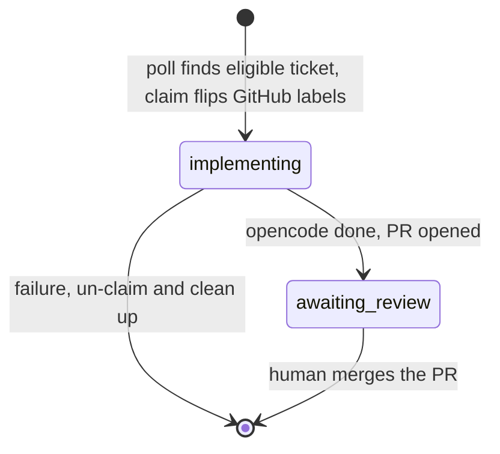
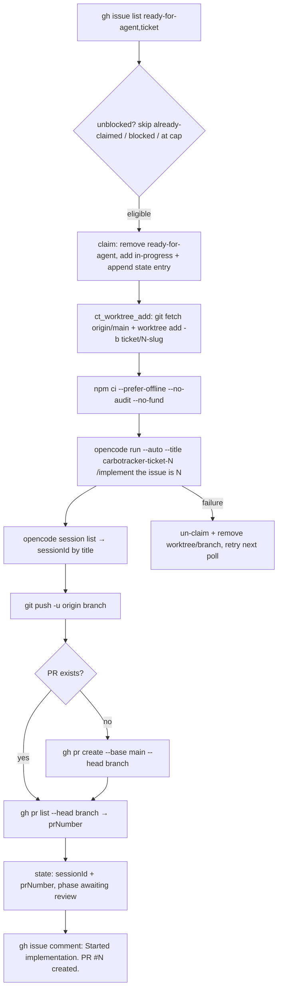

# Carbotracker orchestrator

`ct-orchestrator.sh` is the ticket-to-PR pipeline: it polls GitHub for
`ready-for-agent` tickets, claims them up to a concurrency cap, and runs each
one through a full implementation cycle — worktree, dependency install,
headless `opencode`, and finally a pushed branch with a pull request. It runs
as a systemd user service (see `carbotracker-orchestrator.service`).

## Lifecycle

A ticket moves through phases as the orchestrator works it:



`implementing` means the orchestrator is actively running a session for the
ticket; `awaiting review` means the PR exists and a human should look at it.
Only `implementing` entries count against the concurrency cap.

A claim is recorded **twice**: on the GitHub issue (remove `ready-for-agent`,
add `in-progress`) and in the local state file. The label flip is what makes
the claim visible to humans and atomic against parallel orchestrators — once
an issue drops `ready-for-agent` it stops matching the candidate query, so a
second daemon cannot claim it.

## State file

Active tickets live in a single JSON array, written atomically
(temp file + rename). Default location:
`$HOME/.local/state/carbotracker/orchestrator.json`.

```json
[
  {
    "ticket": 218,
    "branch": "ticket/218-worktree-creation-opencode-implementation-and-pr-tracking",
    "worktree": "/home/steffen/git/worktrees/carbotracker/218-worktree-creation-opencode-implementation-and-pr-tracking",
    "sessionId": "ses_007927ec0ffeYJFyKLBlmBSp1e",
    "prNumber": 234,
    "phase": "awaiting review",
    "startedAt": "2026-08-13T00:07:00Z"
  }
]
```

| Field       | Meaning                                                 |
| ----------- | ------------------------------------------------------- |
| `ticket`    | GitHub issue number being implemented                   |
| `branch`    | `ticket/<issue>-<slug>` branch the work happens on      |
| `worktree`  | Absolute path of the git worktree for that branch       |
| `sessionId` | opencode session id for the run (`null` until it exits) |
| `prNumber`  | PR opened for the branch (`null` until it exists)       |
| `phase`     | `implementing` or `awaiting review`                     |
| `startedAt` | UTC timestamp of the claim                              |

## Data flow per poll



The orchestrator never resolves review threads or merges — after the PR is
opened it hands off to a human.

## Configuration

Sourced from `ct-orchestrator.conf` (environment variables win over the conf
file, which wins over defaults):

| Variable                             | Default                                             |
| ------------------------------------ | --------------------------------------------------- |
| `ORCHESTRATOR_POLL_INTERVAL_SECONDS` | `300`                                               |
| `ORCHESTRATOR_CONCURRENCY_CAP`       | `3`                                                 |
| `ORCHESTRATOR_ISSUE_LABELS`          | `ready-for-agent,ticket`                            |
| `ORCHESTRATOR_IN_PROGRESS_LABEL`     | `in-progress`                                       |
| `ORCHESTRATOR_STATE_FILE`            | `$HOME/.local/state/carbotracker/orchestrator.json` |
| `ORCHESTRATOR_WORKTREE_PARENT`       | `$HOME/git/worktrees/carbotracker`                  |

## Running

- `ct-orchestrator.sh` — run the daemon (systemd user service).
- `ct-orchestrator.sh once` — run a single poll cycle and exit.
- `ct-orchestrator.sh help` — show usage.

Follow the daemon with `journalctl --user -u carbotracker-orchestrator -f`.

## Design notes

- Branch/worktree naming is derived once in the poll loop (`slugify`) and
  handed to `ct_worktree_add`, so the state file and the actual worktree can
  never drift apart.
- A failed step un-claims the ticket and removes the worktree and branch, so
  the next poll starts clean. This means push/PR failures retry the whole
  `opencode` run, which is wasteful but simple and safe. Cleanup is guarded:
  only a worktree this run actually created (`CT_WORKTREE_CREATED`) is
  removed, so a parallel orchestrator that loses the claim race never deletes
  the winner's worktree.
- `orchestrator_log` writes to stderr: several helpers return their value on
  stdout inside `$(...)`, so log lines must never land there.
